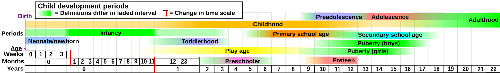

# Baby Development

## Terminology

Use the correct terminology when talking about baby development.

> By Mikael Häggström - Own work, Public Domain, https://commons.wikimedia.org/w/index.php?curid=7209351

## Baby Timeline

There are different sources for baby development[^who_growth_standards][^wiki_child_dev_stages][@Scharf2016-kr;@Wilks2010-hm;@Gerber2010-dp;@Gerber2011-ui]. However, it may not be easy to read and track. We found that a Gannt chart is helpful. One of the tricks is to select some important and skills of interest, and create a Gannt chart like the following. We have listed more detailed milestones in the [[development/milestones|Milestones]] section.

```mermaid
gantt
    title A Demo of a Customized Baby Development Timeline by Weeks
    dateFormat X
    axisFormat %s
    section Gross Motor Milestones
        "When held upright, holds head erect and steady." : 4, 6
        "When prone, lifts self by arms; rolls from side to back." : 6, 8
        "Rolls from tummy to side" : 8, 10
        "Rests on elbows, lifts head 90 degrees" : 8, 10
        "Sits propped up with hands, head steady for a short time" : 8, 10
        "Sitting without support"   : 15, 28
        "Standing with assistance"  : 20, 46
        "Hands-&-knees crawling"    : 21, 54
        "Walking with assistance"   : 24, 55
        "Standing alone"            : 28, 67
        "Walking alone"             : 33, 70
    section Speech and Language
        "Cooes and babbles"         : 4, 6
        "Vocalizes"                 : 6, 8
        "makes vowel-like noises"   : 6, 8
    section Vision & Hearing
        "Focuses on parents"        : 4, 6
        "Focuses on objects as well as adults" : 6, 8
    section Social
        "Startled by sudden noises" : 4, 6
        "smile at parents" : 4, 8
        "Loves looking at new faces" : 4, 6
        "Recognition of familiar individuals" : 4, 6
        "Loves looking at new faces" : 6, 8
    section Vaccine
        BCG  : 0, 1
        Oral polio 1 : 0, 1
        Oral polio 2 : 6, 7
        Oral polio 3 : 10, 11
        Oral polio 4 : 14, 15
        DTP 1 : 6, 7
        DTP 2 : 10, 11
        DTP 3 : 14, 15
        Hepatitis B Schema A 1 : 0, 1
        Hepatitis B Schema A 2 : 6, 7
        Hepatitis B Schema A 3 : 14, 15
        Hepatitis B Schema B 1 : 6,7
        Hepatitis B Schema B 2 : 10,11
        Hepatitis B Schema B 3 : 14,15
```

!!! warning "Each Baby is Different"

    The following timeline is only one possibility, and the actual development and other schedules may vary from baby to baby.

## Useful Booklets

WHO has a booklets to help parents and caregivers understand and record the growth and development of their children[^who_growth_standards]. Please visit [this page](https://www.who.int/toolkits/child-growth-standards) and find the booklets as highlighted below. The booklets includes important information such as [[development/milestones|milestones]] and [[development/growth_charts|growth charts]].

??? note "Growth Record Booklets"

    === "Girls Growth"

        { type=application/pdf style="min-height:70vh;width:100%" }

    === "Boys Growth"

        { type=application/pdf style="min-height:70vh;width:100%" }

## Research Papers

<iframe src="https://app.litmaps.com/shared/0c627363-ffdf-4e92-8a6b-6696a7e1b368"  frameborder="0" style="overflow:hidden;height:800px;width:100%" height="800px" width="100%" title="Research Papers about Pregnancy"></iframe>

[^who_growth_standards]: WHO, “The WHO Child Growth Standards,” World Health Organization. Available: https://www.who.int/toolkits/child-growth-standards. [Accessed: May 31, 2025]
[^wiki_child_dev_stages]: Contributors to Wikimedia projects, “Child development stages,” Wikipedia, May 21, 2025. Available: https://en.wikipedia.org/wiki/Child_development_stages. [Accessed: Jun. 01, 2025]
