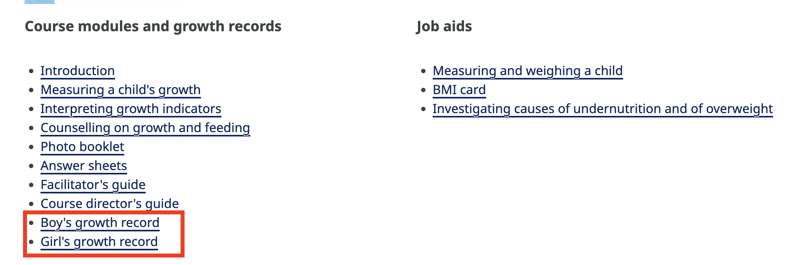

# Baby Development

## Baby Timeline

We combine different sources and created the following timeline for baby development[^who_growth_standards]. The following timeline is only one possibility, and the actual development and other schedules may vary from baby to baby.

```mermaid
gantt
    title Baby Development Timeline by Weeks
    dateFormat X
    axisFormat %s
    section Motor Skills
        "Sitting without support"   : 15, 28
        "Standing with assistance"  : 20, 46
        "Hands-&-knees crawling"    : 21, 54
        "Walking with assistance"   : 24, 55
        "Standing alone"            : 28, 67
        "Walking alone"             : 33, 70
    section Vaccine
        BCG  : 0, 1
        Oral polio 1 : 0, 1
        Oral polio 2 : 6, 7
        Oral polio 3 : 10, 11
        Oral polio 4 : 14, 15
        DTP 1 : 6, 7
        DTP 2 : 10, 11
        DTP 3 : 14, 15
        Hepatitis B Schema A 1 : 0, 1
        Hepatitis B Schema A 2 : 6, 7
        Hepatitis B Schema A 3 : 14, 15
        Hepatitis B Schema B 1 : 6,7
        Hepatitis B Schema B 2 : 10,11
        Hepatitis B Schema B 3 : 14,15
```

## Useful Booklets

WHO has a booklets to help parents and caregivers understand and record the growth and development of their children[^who_growth_standards].

??? note "Growth Record Booklets"

    === "Girls Growth"

        { type=application/pdf style="min-height:70vh;width:100%" }

    === "Boys Growth"

        { type=application/pdf style="min-height:70vh;width:100%" }

[^who_growth_standards]: WHO, “The WHO Child Growth Standards,” World Health Organization. Available: https://www.who.int/toolkits/child-growth-standards. [Accessed: May 31, 2025]
