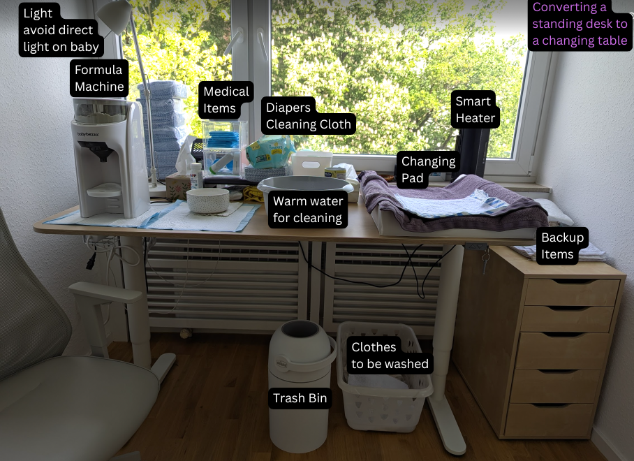
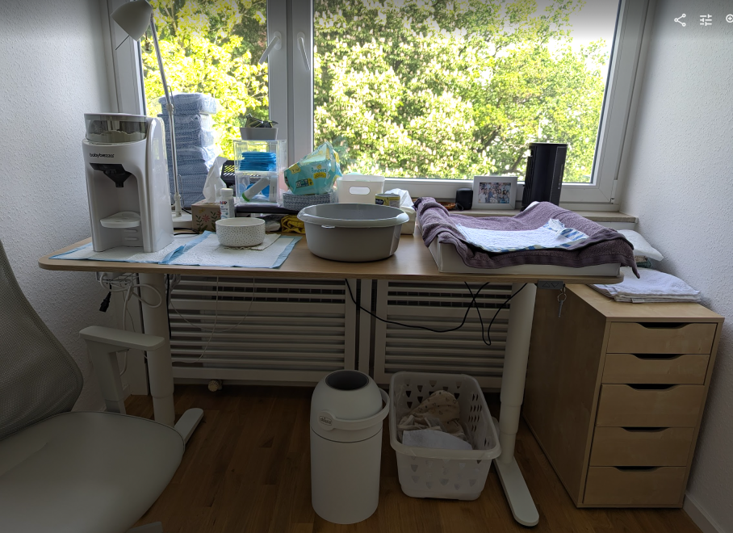
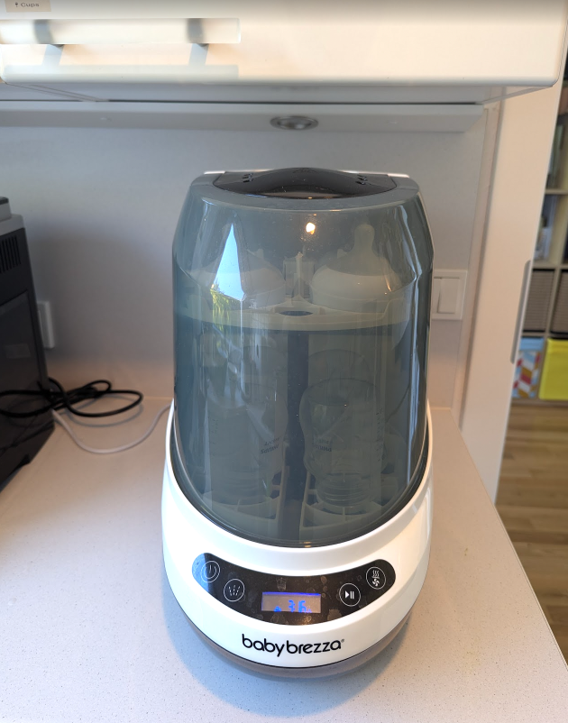

# Changing Table

We converted a standing desk to a changing table. The idea is that we can adjust to our individual height so that we don't have to bend down too much. This is especially important for the back, as you will be changing diapers many times a day.

The following is our current setup (as of 2025-05-09):

=== "Annotated Changing Table"

    

=== "Original Changing Table Photo"

    

## Nappy Bin

We use this [[products/chicco_nappy_bin|Chicco nappy bin]] for nappy disposal.

## Formula Machine

We use the [[products/baby_brezza_formula_pro_advanced|Baby Brezza Formula Pro Advanced]] to prepare formula milk.

## Bottle Washer

We use the [[products/baby_brezza_bottle_washer_pro|Baby Brezza Bottle Washer Pro]] to wash bottles.

!!! tip "Where do we put it"

    We have to put it in the kitchen due to limited space. Also we don't want to have any leakage on the parquet floor.

## Changing Table Heater

We use the [[products/reer_changing_table_heater|reer FeelWell 2-in-1 Nappy Changing Table Heater]].

!!! tip "It heats up fast"

    We did some random tests and it can raise the temperature from 24 to 25 in less than 1 minute.

!!! tip "Make it Smart"

    Combined with a smart plug, sensors and smart button, we made it easier to use.
