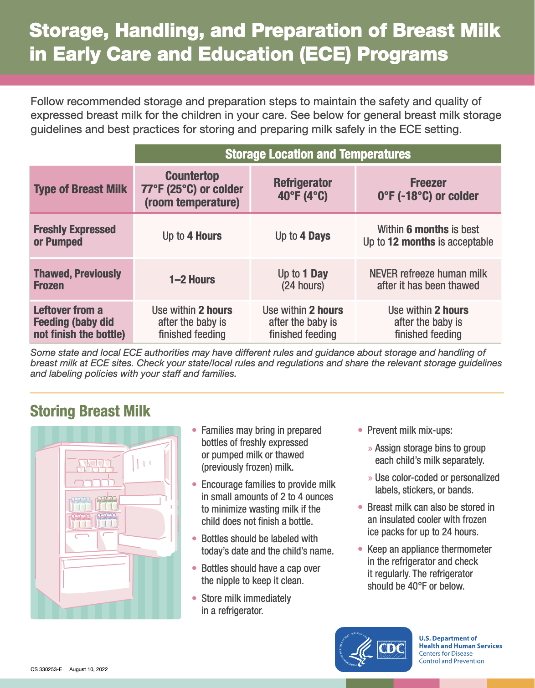
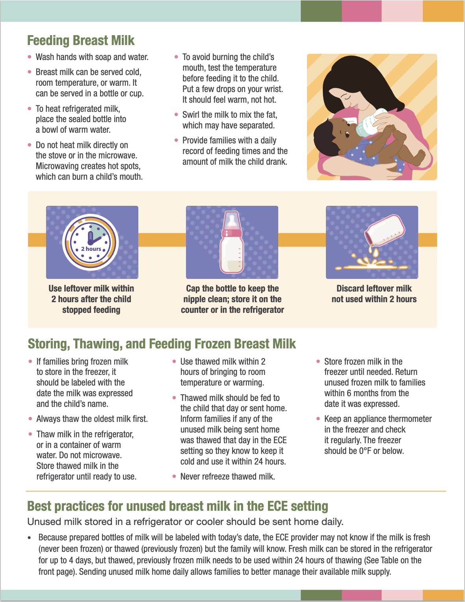

# Mother's Milk

## Storing Mother's Milk

At room temperature (~ 25°C), up to 4 hours[^cdc_breast_milk][^nhs_breast_milk]. CDC provides a nice info-graphic for storing breast milk[^cdc_storage_info].

[^cdc_breast_milk]: CDC. Breast Milk Storage and Preparation. Breastfeeding. 2024.https://www.cdc.gov/breastfeeding/breast-milk-preparation-and-storage/handling-breastmilk.html#:~:text=Freshly%20expressed%20or%20pumped%20milk,to%2012%20months%20is%20acceptable. (accessed 9 May2025).
[^nhs_breast_milk]: Expressing and storing breast milk. nhs.uk. https://www.nhs.uk/baby/breastfeeding-and-bottle-feeding/breastfeeding/expressing-breast-milk/ (accessed 9 May2025).
[^cdc_storage_info]: Centers for Disease Control and Prevention. Storage, Handling, and Preparation of Breast Milk in Early Care and Education (ECE) Programs. https://www.cdc.gov/obesity/strategies/early-care-education/pdf/Breastmilk-ECE-082022-508.pdf (accessed 9 May2025).
