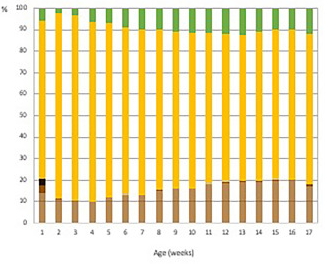
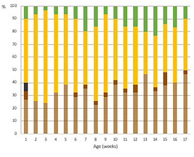
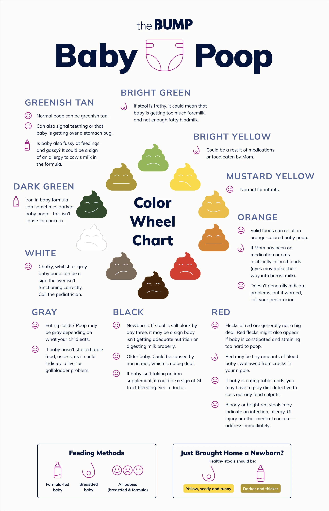
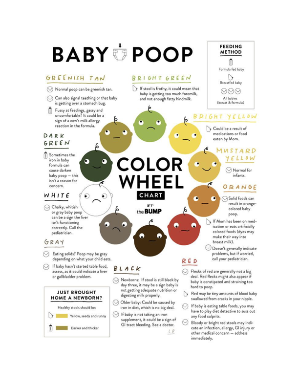

# Poop

## Poop Colors

### Poop Colors and Feeding

Full term baby poop colors vary depending on a lot of factors. A research on 1052 infants by Solasaari et al. 2024 shows the difference of color distribution for breastfeeding and formula feeding [@Solasaari2024-ca].

=== "Breastfeeding Poop Color Distribution"

    

=== "Formula Feeding Poop Color Distribution"

    

### Poop Wheels and Palettes

There are different versions of the so-called "Poop Wheel". One of the most popular ones is the one from [The Bump](https://www.thebump.com/a/baby-poop). It is a wheel that shows the different types of poop your baby can have [^bump_poop_wheel].

??? info "Other Versions and Sources"

    Copley Hospital also have a hand-drawn version of it[^copley_poop_wheel]. It is hard to trace which was the original version of the poop wheel. There are also versions with different visualizations such as palettes[^cleveland_clinic_poop_palette].

    It is not easy to get the original research papers as there are no references mentioned in the chart.

=== "Poop Wheel (The Bump Version)"

    

=== "Poop Wheel (Copley Hospital Version)"

    

[^bump_poop_wheel]: Davies A. Poop Guide for Babies: a Comprehensive Guide to Baby Poop. The Bump. 2024.https://www.thebump.com/a/baby-poop (accessed 19 May2025).
[^copley_poop_wheel]: Women’s Center Pregnancy Resources. Copley Hospital. 2021.https://www.copleyvt.org/womens-center-pregnancy-resources/ (accessed 19 May2025).
[^cleveland_clinic_poop_palette]: Cleveland Clinic Baby Poop Colors: What Do They Mean? Cleveland Clinic. 2024.https://health.clevelandclinic.org/the-color-of-baby-poop-and-what-it-means-infographic (accessed 19 May2025).
