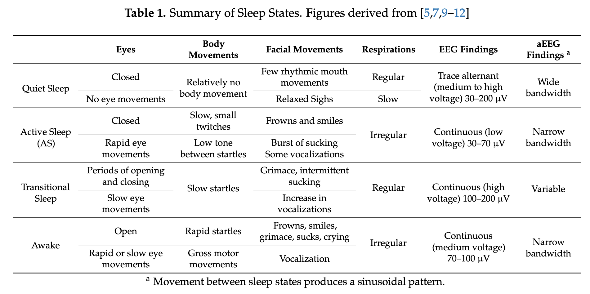
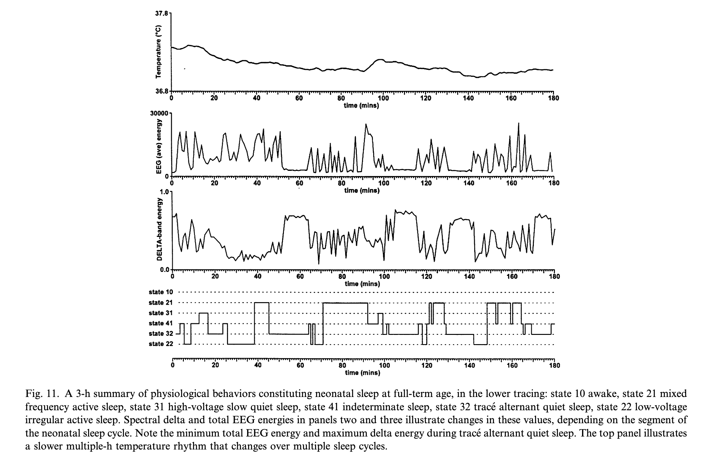
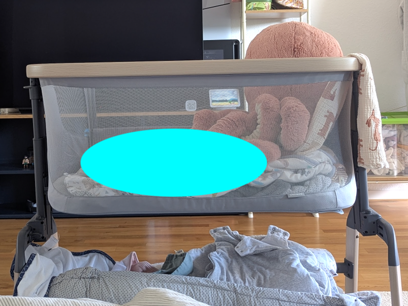

# Sleeping

Full term infants sleep about 70% of the time[@Barbeau2017-sf].

## Sleeping Stages and Categories

There are different sleep stages:

- Quiet sleep;
- Active sleep;
- Transitional Sleep.


> Table from Barbeau & Weiss 2017 [@Barbeau2017-sf].

Durations of different sleep stages may vary. See the figure below for an example[@Scher2008-va].


> Figure from Scher et al. 2008 [@Scher2008-va].


!!! tip "20 Minutes Rule"

    An idea would be that we only put down the baby 20min if she/he falls asleep in our arms. This would be a safe bet that the baby is not in a transitional sleep stage. But I didn't find enough data to support this idea only the above EEG sample.


## Sleeping Length

There is not much sleeping length study for new born infants. We found a research paper Parmelee et al. 1964 that collected data of sleeping hours per day of 46 new born infants. The following tables and visualizations are based on their table 2[@Parmelee1964-oc]. We observe a decrease in sleeping hours per day and an increase in the longest sleep duration. The trend is visualized below.


=== ":material-chart-box-outline: Sleeping Hours Per Day"

    The following chart shows the average total daily sleep (hours) and the standard deviation (error bars) of the data.


    ```vegalite
    {
      "$schema": "https://vega.github.io/schema/vega-lite/v5.json",
      "description": "Sleeping Hours Per Day from Parmelee et al. 1964",
      "data": {
        "values": [
          { "age_weeks": 1, "mean_sleep": 16.32, "sd_sleep": 1.72 },
          { "age_weeks": 2, "mean_sleep": 16.25, "sd_sleep": 1.60 },
          { "age_weeks": 4, "mean_sleep": 15.43, "sd_sleep": 1.60 },
          { "age_weeks": 8, "mean_sleep": 15.42, "sd_sleep": 1.70 },
          { "age_weeks": 12, "mean_sleep": 15.11, "sd_sleep": 1.48 },
          { "age_weeks": 16, "mean_sleep": 14.87, "sd_sleep": 1.39 }
        ]
      },
      "transform": [
        {
          "calculate": "datum.mean_sleep - datum.sd_sleep",
          "as": "lower_sleep"
        },
        {
          "calculate": "datum.mean_sleep + datum.sd_sleep",
          "as": "upper_sleep"
        }
      ],
      "layer": [
        {
          "mark": "errorbar",
          "encoding": {
            "y": {
              "field": "upper_sleep",
              "type": "quantitative",
              "scale": {"zero": false},
              "title": "Average Total Daily Sleep (hours)"
            },
            "y2": { "field": "lower_sleep" },
            "x": {
              "field": "age_weeks",
              "type": "quantitative",
              "title": "Age (weeks)"
            }
          }
        },
        {
          "mark": {
            "type": "point",
            "filled": true,
            "color": "black"
          },
          "encoding": {
            "y": {
              "field": "mean_sleep",
              "type": "quantitative"
            },
            "x": {
              "field": "age_weeks",
              "type": "quantitative"
            }
          }
        }
      ]
    }
    ```

=== "Longest Sleep Duration"

    The following chart shows the average daily longest sleep (hours) and the standard deviation (error bars) of the data.

    ```vegalite
      {
      "$schema": "https://vega.github.io/schema/vega-lite/v5.json",
      "description": "Average daily longest sleep of infants with standard deviation as error bars.",
      "data": {
        "values": [
          { "age_weeks": 1, "mean_longest_sleep": 4.08, "sd_longest_sleep": 0.67 },
          { "age_weeks": 2, "mean_longest_sleep": 4.41, "sd_longest_sleep": 0.95 },
          { "age_weeks": 4, "mean_longest_sleep": 4.62, "sd_longest_sleep": 1.02 },
          { "age_weeks": 8, "mean_longest_sleep": 6.47, "sd_longest_sleep": 1.42 },
          { "age_weeks": 12, "mean_longest_sleep": 7.67, "sd_longest_sleep": 1.69 },
          { "age_weeks": 16, "mean_longest_sleep": 8.48, "sd_longest_sleep": 1.69 }
        ]
      },
      "transform": [
        {
          "calculate": "datum.mean_longest_sleep - datum.sd_longest_sleep",
          "as": "lower_longest_sleep"
        },
        {
          "calculate": "datum.mean_longest_sleep + datum.sd_longest_sleep",
          "as": "upper_longest_sleep"
        }
      ],
      "layer": [
        {
          "mark": "errorbar",
          "encoding": {
            "y": {
              "field": "upper_longest_sleep",
              "type": "quantitative",
              "scale": {"zero": false},
              "title": "Average Daily Longest Sleep (hours)"
            },
            "y2": { "field": "lower_longest_sleep" },
            "x": {
              "field": "age_weeks",
              "type": "quantitative",
              "title": "Age (weeks)"
            }
          }
        },
        {
          "mark": {
            "type": "point",
            "filled": true,
            "color": "black"
          },
          "encoding": {
            "y": {
              "field": "mean_longest_sleep",
              "type": "quantitative"
            },
            "x": {
              "field": "age_weeks",
              "type": "quantitative"
            }
          }
        }
      ]
    }
    ```

=== "Daily Longest Wakefulness"

    The following chart shows the average daily longest wakefulness (hours) and the standard deviation (error bars) of the data.

    ```vegalite
    {
      "$schema": "https://vega.github.io/schema/vega-lite/v5.json",
      "description": "Average daily longest wakefulness of infants with standard deviation as error bars.",
      "data": {
        "values": [
          { "age_weeks": 1, "mean_longest_wake": 2.39, "sd_longest_wake": 0.84 },
          { "age_weeks": 2, "mean_longest_wake": 2.61, "sd_longest_wake": 0.89 },
          { "age_weeks": 4, "mean_longest_wake": 3.08, "sd_longest_wake": 1.04 },
          { "age_weeks": 8, "mean_longest_wake": 3.15, "sd_longest_wake": 1.10 },
          { "age_weeks": 12, "mean_longest_wake": 3.41, "sd_longest_wake": 0.92 },
          { "age_weeks": 16, "mean_longest_wake": 3.56, "sd_longest_wake": 1.05 }
        ]
      },
      "transform": [
        {
          "calculate": "datum.mean_longest_wake - datum.sd_longest_wake",
          "as": "lower_longest_wake"
        },
        {
          "calculate": "datum.mean_longest_wake + datum.sd_longest_wake",
          "as": "upper_longest_wake"
        }
      ],
      "layer": [
        {
          "mark": "errorbar",
          "encoding": {
            "y": {
              "field": "upper_longest_wake",
              "type": "quantitative",
              "scale": { "zero": false },
              "title": "Average Daily Longest Wakefulness (hours)"
            },
            "y2": { "field": "lower_longest_wake" },
            "x": {
              "field": "age_weeks",
              "type": "quantitative",
              "title": "Age (weeks)"
            }
          }
        },
        {
          "mark": {
            "type": "point",
            "filled": true,
            "color": "black"
          },
          "encoding": {
            "y": {
              "field": "mean_longest_wake",
              "type": "quantitative"
            },
            "x": {
              "field": "age_weeks",
              "type": "quantitative"
            }
          }
        }
      ]
    }
    ```

=== ":material-table-large: Data Table"

    | Age in weeks | Average total daily sleep (hours) | S.D. | Average daily longest sleep (hours) | S.D. | Average daily longest wakefulness (hours) | S.D. |
    |--------------|-----------------------------------|------|-------------------------------------|------|-------------------------------------------|------|
    | 1            | 16.32                             | 1.72 | 4.08                                | 0.67 | 2.39                                      | 0.84 |
    | 2            | 16.25                             | 1.60 | 4.41                                | 0.95 | 2.61                                      | 0.89 |
    | 4            | 15.43                             | 1.60 | 4.62                                | 1.02 | 3.08                                      | 1.04 |
    | 8            | 15.42                             | 1.70 | 6.47                                | 1.42 | 3.15                                      | 1.10 |
    | 12           | 15.11                             | 1.48 | 7.67                                | 1.69 | 3.41                                      | 0.92 |
    | 16           | 14.87                             | 1.39 | 8.48                                | 1.69 | 3.56                                      | 1.05 |


## Sleeping Positions

It is recommended to put the baby in the supine position when sleeping. However, there is a tendency for parents to be noncompliant with this recommendation through time[@Hauck2008-fv]. It is a reminder to all of us to be vigilant.

```vegalite
{
  "description": "Sleeping Positions Survey from the Infant Feeding Practices Study II",
  "data": {
    "values": [
      {"Infant Age": "2 weeks", "Fraction": 0.79}, {"Infant Age": "1 month", "Fraction": 0.77}, {"Infant Age": "2 month", "Fraction": 0.75},
      {"Infant Age": "3 month", "Fraction": 0.74}, {"Infant Age": "6 month", "Fraction": 0.71}, {"Infant Age": "9 month", "Fraction": 0.66},
      {"Infant Age": "12 month", "Fraction": 0.64}
    ]
  },
  "mark": {"type": "bar", "tooltip": true},
  "encoding": {
    "x": {"field": "Infant Age", "type": "nominal", "sort": false, "axis": {"labelAngle": 0}},
    "y": {"field": "Fraction", "type": "quantitative", "scale": {"domain": [0, 1]}, "title": "Fraction of Parents"}
  }
}
```

> Sleeping positions survey from Hauck et al. 2008 [@Hauck2008-fv]

??? info "Infant Feeding Practice Study (IFPS)"

    CDC. Infant Feeding Practice Study (IFPS). Breastfeeding Data. 2025.https://www.cdc.gov/breastfeeding-data/studies/methods-results-ifps.html (accessed 10 May2025).


## Co-Sleeping

There are pros and cons of co-sleeping[@Sadeh2010-uu]. The following table is a summary of the arguments mentioned in Sadeh et al. 2010:

| **Aspect**                 | **Arguments For Co-Sleeping**                                                                                  | **Arguments Against Co-Sleeping**                                                                                           |
|---------------------------|------------------------------------------------------------------------------------------------------------------|------------------------------------------------------------------------------------------------------------------------------|
| **Nature and Needs**      | Most natural sleeping arrangement; best meets infant’s psycho-physiological needs                               | May hinder development of infant independence and autonomy                                                                   |
| **Breastfeeding**         | Facilitates breastfeeding                                                                                        | —                                                                                                                            |
| **Emotional Development** | Supports socio-emotional development through close caregiver contact                                             | —                                                                                                                            |
| **Safety**                | May protect against SIDS                                                                                         | Increases risk of death or accidents; safety concerns outweigh benefits                                                      |
| **Sleep Quality**         | —                                                                                                                | Associated with more sleep problems, especially night waking and bedtime struggles                                           |


## Parental Intervention

> ... excessive active physical comforting combined with reduced encouragement of infant’s autonomy was associated with infant sleeping problems.
>
> — Sadeh et al. 2010 [@Sadeh2010-uu]

Research indicates that parents should encouraging independence and self-soothing to improve the sleep quality of the infant and also the wellbeing of the parents[@Sadeh2010-uu].


## Bed

!!! tip ""

    We use this [[products/maxi_cosi_iora_air_bed|Maxi Cosi Iora Air]] bed for the baby. We move it to the living room during the day and to the bedroom at night.

    


## Evenings

### Lights

!!! tip ""
    We realized that our lights might be a bit too bright for the baby. So we dimmed all our ceiling lights and changed other lamps to warm or reddish color.

    We use this [[products/cotabaty_baby_night_light|Cotabaty Baby Night Light]] to check the baby during the night.


## Further Reading


1 The sleep and sleep rhythm of babies in the 1st year of life. FAMILIENPORTAL.NRW. https://www.familienportal.nrw/en/0-bis-1-jahre/gesundheit-kind/sleeping. (accessed 10 May2025).


## Other Research Papers

<iframe src="https://app.litmaps.com/shared/f7a78020-a15a-4760-9e9e-956e31259a0c"  frameborder="0" style="overflow:hidden;height:800px;width:100%" height="800px" width="100%" title="Research Papers about Pregnancy"></iframe>
