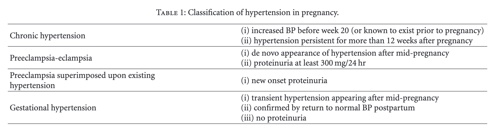

# Pregnancy Topics

!!! note "Review of Discomforts During Pregnancy"

    [D. C. Davis, “The discomforts of pregnancy,” J. Obstet. Gynecol. Neonatal Nurs., vol. 25, no. 1, pp. 73–81, Jan. 1996, doi: 10.1111/j.1552-6909.1996.tb02516.x. Available: http://dx.doi.org/10.1111/j.1552-6909.1996.tb02516.x. [Accessed: May 10, 2025]](http://dx.doi.org/10.1111/j.1552-6909.1996.tb02516.x)[@Davis1996-av]

!!! note "Article on Psychological Changes During Pregnancy"

    [A. Carlin and Z. Alfirevic, “Physiological changes of pregnancy and monitoring,” Best Pract. Res. Clin. Obstet. Gynaecol., vol. 22, no. 5, pp. 801–823, Oct. 2008, doi: 10.1016/j.bpobgyn.2008.06.005. Available: http://dx.doi.org/10.1016/j.bpobgyn.2008.06.005. [Accessed: May 10, 2025]](http://dx.doi.org/10.1016/j.bpobgyn.2008.06.005)[@Carlin2008-bn]

## Weight

!!! tip "Weight Tracking"
    We use the [[products/withings_body_smart|Withings Body Smart]] scale to track weight gain during pregnancy.

## Constipation

[[products/zirkulin_bio_flohsamen_schalen|Zirkulin Bio Flohsamen Schalen]] is recommended by our gynecologist to help with constipation. It is also supported by research[@Trottier2012-ka].

## Sleeping

A large fraction of pregnant women reported sleep disruption during pregnancy [@Won2015-wz].

!!! note "A Good Read"

    [Won CHJ. Sleeping for Two: The Great Paradox of Sleep in Pregnancy. Journal of Clinical Sleep Medicine 2015.](https://jcsm.aasm.org/doi/10.5664/jcsm.4760) is a fun read.

## Hypertension

Some pregnant women may experience hypertension [@Mustafa2012-vi].

> Table from Mustafa 2012 [@Mustafa2012-vi].

??? note "Blood Pressure and Cardio Output Changes During Pregnancy"

    Blood pressure changes during pregnancy[@Mustafa2012-vi].

    
    > Figure from Mustafa et al 2012 [@Mustafa2012-vi].

## Other Research Topics

<iframe src="https://app.litmaps.com/shared/86bcd3b8-7367-4935-8473-64593f3f859a"  frameborder="0" style="overflow:hidden;height:800px;width:100%" height="800px" width="100%" title="Research Papers about Pregnancy"></iframe>
