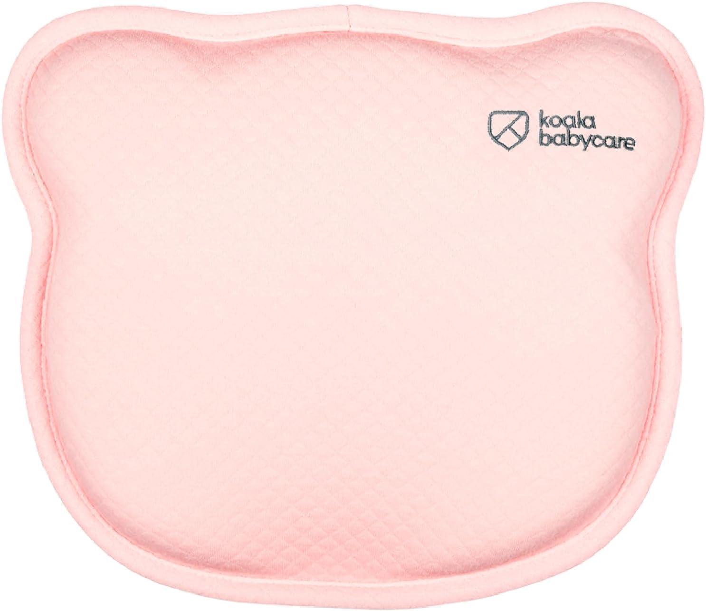

# Koala Babycare Orthopaedic Baby Pillow

| Recommended | Where | Used During |
| ----------- | ---------- | ----------- |
| :material-check:       |      [Amazon](https://amzn.eu/d/9GSyMln)  | 1-2 month |

We find this pillow very useful for our baby especially in the first two months. It helped our baby sleep with a fixed head position.

On the other hand, we also find we don't use it as much when our baby reaches the third month.

