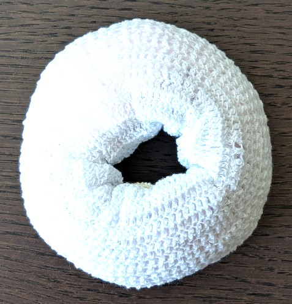

# Vienna Breastfeeding Donut

| Recommended | Where |
| ----------- | ---------- |
| :material-close:       |  Hospital |

A Vienna Breastfeeding Donut is help relieve the pain of sore or cracked nipples.

It can be purchased but also here is a manual to make it yourself using bandage and nursing pads: [Vienna Breastfeeding Donut](https://www.elacta.eu/wp-content/uploads/2017/04/Vienna-Breastfeeding-Donut.pdf).
