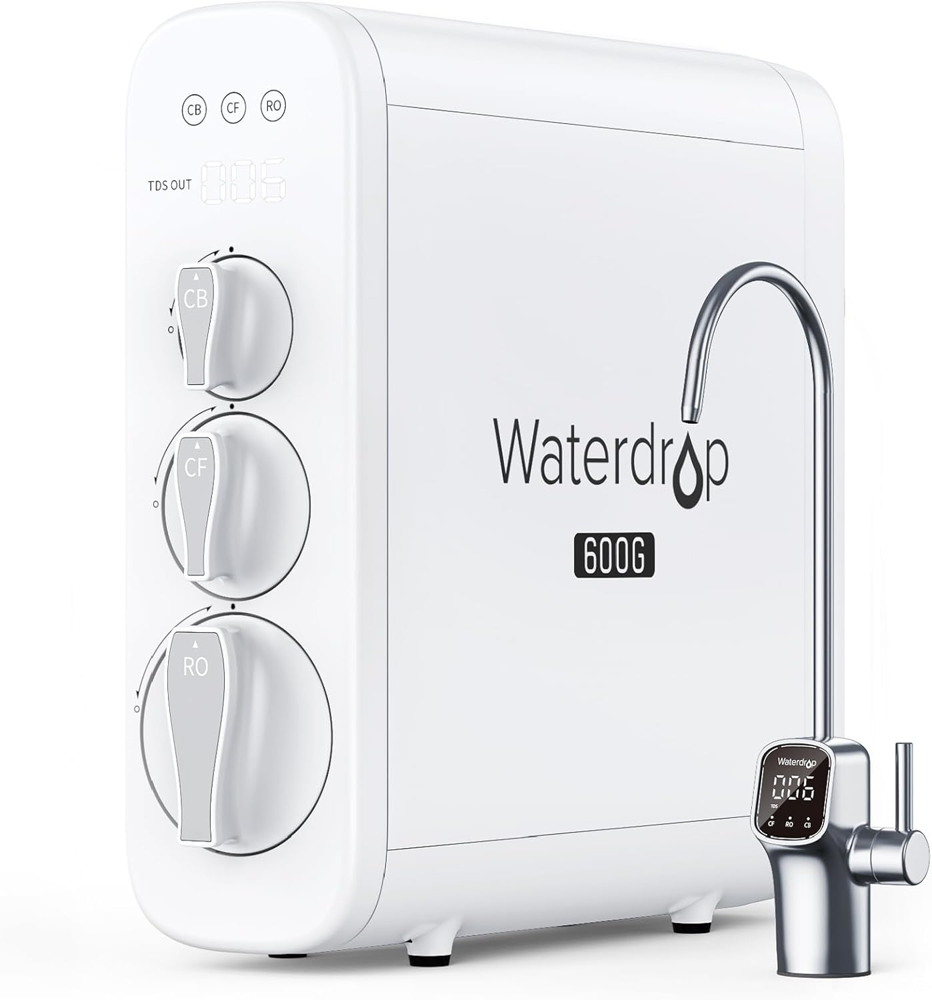

# Waterdrop Reverse Osmosis System

| Recommended | Where | Used During |
| ----------- | ---------- | ----------- |
| :material-check:       |      [Amazon](https://amzn.eu/d/d56VSZq)  | 0 month -  |

We use this to soften the water in our home. It is especially useful for reducing TDS (Total Dissolved Solids) in the water for [[products/baby_brezza_bottle_washer_pro|Baby Brezza Bottle Washer Pro]].

